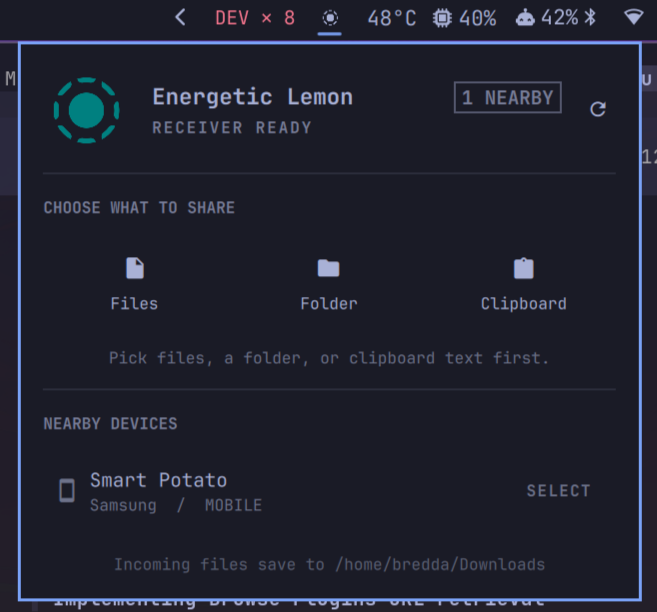

# LocalSend for Omarchy

A native Omarchy Shell integration for [LocalSend](https://localsend.org/) that runs entirely in the background. Discover devices, choose files or clipboard text, review incoming requests, and track transfers without opening the LocalSend GUI.



## Features

- Theme-controlled symbolic status-bar icon
- Pause or resume receiving entirely (device stops announcing itself on the network)
- Regenerate the device name (random friendly alias, persisted)
- Clear transfer activity history
- Official colored LocalSend icon inside the panel
- Nearby-device discovery over LocalSend protocol v2.2
- File, folder, and clipboard-text sharing
- Explicit Accept and Decline controls for incoming requests
- Desktop notifications for new requests
- Live transfer progress, history, errors, and cancellation
- Incoming clipboard text copied with `wl-copy`
- Incoming files saved to the XDG Downloads directory
- TLS certificate pinning and a private Unix management socket
- No LocalSend GUI, TUI, or tray process

## Install

Quit any running LocalSend GUI first because both receivers use port `53317`, then run:

```bash
omarchy plugin add https://github.com/cryptobredda/omarchy-localsend --enable --yes
```

The plugin appears in the right side of the bar by default. On first use, its reviewed launcher downloads the checksum-pinned x86-64 controller from the repository's attested GitHub release. Rust is not required for installation, and the verified controller is reused while offline.

Runtime requirements:

- Omarchy 4.0 or newer, which provides the shell, file picker, and notification helpers
- x86-64 Linux with glibc 2.39 or newer
- `curl` for the initial HTTPS artifact download
- `coreutils` for the bounded download and size/SHA-256 verification
- `util-linux` for `setpriv`
- `wl-clipboard` for `wl-copy` and `wl-paste`
- Local network access to TCP and UDP port `53317`

The LocalSend application is not required. This plugin does not modify user configuration.

To update later:

```bash
omarchy plugin update bredda.localsend --yes
```

## Remove

```bash
omarchy plugin remove bredda.localsend --yes
```

Removal stops the receiver and removes the plugin code. The persistent identity is intentionally retained so reinstalling does not change the device fingerprint. To reset that identity too, remove `$XDG_STATE_HOME/omarchy/localsend-controller`, or `~/.local/state/omarchy/localsend-controller` when `XDG_STATE_HOME` is unset.

## Use

1. Open the LocalSend bar panel.
2. Choose **Files**, **Folder**, or **Clipboard**.
3. Select a nearby device.
4. Accept or decline incoming requests directly in the panel.

Keyboard shortcuts while the panel is open:

| Key | Action |
| --- | --- |
| `r` | Refresh nearby devices |
| `f` | Choose files |
| `d` | Choose a folder |
| `c` | Select clipboard text |
| `e` | Toggle receiving on/off |
| `n` | Regenerate the device name |
| `h` | Clear activity history |
| `a` | Accept the incoming request |
| `x` | Decline the incoming request |

The receiver can also be toggled without opening the panel via IPC:

```bash
omarchy-shell bredda.localsend toggleReceive
omarchy-shell bredda.localsend enableReceive
omarchy-shell bredda.localsend disableReceive
omarchy-shell bredda.localsend clearHistory
omarchy-shell bredda.localsend regenerateName
```

Example global Hyprland binding (in `~/.config/hypr/bindings.lua`) to open the panel:

```lua
o.bind("SUPER + CTRL + J", "LocalSend panel", "omarchy-shell bredda.localsend toggle")
```

The receiver uses the alias from an existing LocalSend installation when available. Otherwise, it uses the machine hostname.

## Runtime Data

- Management socket: `$XDG_RUNTIME_DIR/omarchy-localsend.sock`
- Persistent identity: `$XDG_STATE_HOME/omarchy/localsend-controller/identity.pem`
- Verified controller cache: `$XDG_CACHE_HOME/omarchy-localsend/controllers/`
- Incoming files: XDG Downloads directory, normally `~/Downloads`

The socket and identity are created with mode `0600`. Incoming transfers are never accepted automatically.

## Build From Source

Requirements:

- Current stable Rust toolchain
- `qmllint` for QML validation
- Omarchy for manifest validation and runtime testing

Build the controller and SHA-256 checksum into `dist/`:

```bash
./scripts/build-controller
```

Run all local checks:

```bash
./scripts/check
```

Cargo output is kept under `$XDG_CACHE_HOME/omarchy-localsend/target` by default, outside the plugin tree. This avoids triggering Omarchy's recursive plugin watcher for every Cargo artifact.

## Release Verification

No compiled executable is committed to this repository. `bin/localsend-controller` is a readable Bash launcher, and `controller-release.env` pins one release tag, asset name, expected byte size, source commit, and SHA-256 digest. The launcher applies that byte ceiling while downloading, then verifies the exact size and digest before every execution and rejects modified or unexpected artifacts.

`.github/workflows/release-controller.yml` builds releases from tagged source using Rust 1.97.1 and actions pinned by full commit SHA. It publishes the checksum and a GitHub artifact provenance attestation. The regular CI workflow independently downloads that exact release, verifies its checksum and attestation against the expected workflow, tag, and source commit, and only then executes it.

## Architecture

`service/Receiver.qml` supervises one foreground controller process for the shell session. The launcher at `bin/localsend-controller` resolves the reviewed release and replaces itself with the verified executable. `widget/LocalSendBar.qml` is a thin per-monitor view that communicates with the service through short JSON RPC commands.

The Rust controller uses LocalSend's official core library at pinned commit `af0416be50770a97760f7070684bc667b759a15c`. It provides discovery, HTTPS transport, transfer decisions, progress, and cancellation without wrapping the interactive LocalSend CLI.

## License

MIT. LocalSend and the Rust dependencies retain their respective licenses.
