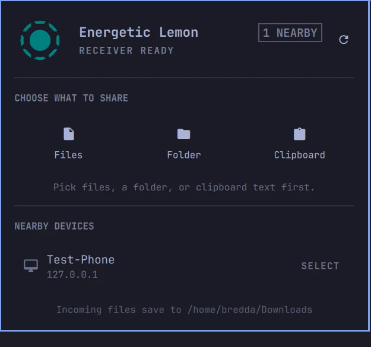

# LocalSend for Omarchy

A native Omarchy Shell integration for [LocalSend](https://localsend.org/) that runs entirely in the background. Discover devices, choose files or clipboard text, review incoming requests, and track transfers without opening the LocalSend GUI.



## Features

- Theme-controlled symbolic status-bar icon
- Official colored LocalSend icon inside the panel
- Nearby-device discovery over LocalSend protocol v2.2
- File, folder, and clipboard-text sharing
- Explicit Accept and Decline controls for incoming requests
- Desktop notifications for new requests
- Live transfer progress, history, errors, and cancellation
- Incoming clipboard text copied with `wl-copy`
- Incoming files saved to the XDG Downloads directory
- TLS certificate pinning and a private Unix management socket
- No LocalSend GUI, TUI, or tray process

## Install

Quit any running LocalSend GUI first because both receivers use port `53317`, then run:

```bash
omarchy plugin add https://github.com/cryptobredda/omarchy-localsend --enable --yes
```

The plugin appears in the right side of the bar by default. It includes a prebuilt x86-64 Linux controller, so Rust is not required for installation.

To update later:

```bash
omarchy plugin update bredda.localsend --yes
```

## Use

1. Open the LocalSend bar panel.
2. Choose **Files**, **Folder**, or **Clipboard**.
3. Select a nearby device.
4. Accept or decline incoming requests directly in the panel.

Keyboard shortcuts while the panel is open:

| Key | Action |
| --- | --- |
| `r` | Refresh nearby devices |
| `f` | Choose files |
| `d` | Choose a folder |
| `c` | Select clipboard text |

The receiver uses the alias from an existing LocalSend installation when available. Otherwise, it uses the machine hostname.

## Runtime Data

- Management socket: `$XDG_RUNTIME_DIR/omarchy-localsend.sock`
- Persistent identity: `$XDG_STATE_HOME/omarchy/localsend-controller/identity.pem`
- Incoming files: XDG Downloads directory, normally `~/Downloads`

The socket and identity are created with mode `0600`. Incoming transfers are never accepted automatically.

## Build From Source

Requirements:

- Current stable Rust toolchain
- `qmllint` for QML validation
- Omarchy for manifest validation and runtime testing

Build and install the controller into `bin/`:

```bash
./scripts/build-controller
```

Run all local checks:

```bash
./scripts/check
```

Build output is kept under `$XDG_CACHE_HOME/omarchy-localsend/target` by default, outside the plugin tree. This avoids triggering Omarchy's recursive plugin watcher for every Cargo artifact.

## Architecture

`service/Receiver.qml` supervises one foreground controller process for the shell session. `widget/LocalSendBar.qml` is a thin per-monitor view that communicates with the service through short JSON RPC commands.

The Rust controller uses LocalSend's official core library at pinned commit `af0416be50770a97760f7070684bc667b759a15c`. It provides discovery, HTTPS transport, transfer decisions, progress, and cancellation without wrapping the interactive LocalSend CLI.

## License

MIT. LocalSend and the Rust dependencies retain their respective licenses.
